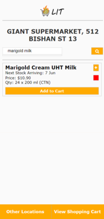

## LIT: the Logistics Inventory Tracker

*Note: The build no longer works as the AWS environment is no longer active. This repository is for archiving and display purposes only.*

The Logistics Inventory Tracker (LIT) is a mobile application that aims to mitigate the risk of infectious disease transmission and strain on supermarket logistics induced by "panic buying" at times of health crises by allowing users to check the availability of items at nearby grocers.

## Background
The Logistics Inventory Tracker (LIT) was conceived and created for the DSTA Brainhack 2020 CODE_EXP Hackathon, where it became the **winning entry of the JC/Poly/ITE Category**. The theme of the Hackathon was to create a cloud-based mobile application to increase Singapore's resilience during times of health crises.

**Our Problem Statement:** Mass buying of essentials, or “panic buying”, as a result of a health crisis increases the risk of transmission due to overcrowding and places undue pressure on the logistics of essential items, especially in supermarkets, reducing the resilience of the community’s health and logistics.

## Screenshots
*These screenshots are from an earlier build and with a smaller database.*

When they load into the app, users will have the choice to create a new Shopping Cart or pick up from where they left off.

The user keys in the store they want to visit. The application pulls the list of stores that match the user's search from the database.

Users can search for items to check their availability at the selected store. The **colour indicator** shows that the inventory of milk is running low. This indicator can be red, yellow or green, indicating the inventory level. The search also displays information such as price, size, and if the inventory level is low, when stocks will next be replenished.

If there is sufficient stock (or the user wants to take his/her chances), the user can "Add to Cart", saving the item into their cart (see below).

If stocks are running low, users can check if the two closest stores (to the selected store) have the item in stock.

When the user goes to the store, they can pull up their saved items within their shopping cart, both as a reminder of what items to buy and to check the items' availability one more time.

## Tech Stack
**Technologies used:**

1. HTML/CSS
2. Javascript
3. Apache Cordova
4. AWS Relational Database Service
5. AWS Elastic Beanstalk (to host PHP files)

This application was first written as a web app (using HTML, CSS and Javascript) before being built for the Android 10.0 Operating System in Apache Cordova.

The application uses a RESTful API, sending an AJAX request to PHP files hosted on AWS Elastic Beanstalk to access a database hosted on AWS Relational Database Service.

## Build Status

On Hold.

## Navigating the Repository
The APK of the application can be found in main folder, named `LIT.apk`.

The HTML, CSS and Javascript files that constitute the application can be found under `source_files/LitApp_source_cordova/www/`.

The SQL commands used to build the demo database can be found at `source_files/LIT Cart RDS Builder SQL.sql`.

The PHP files uploaded to AWS Elastic Beanstalk can be found at `source_files/LIT_php_updated.zip`.

## Credits
The team consists of:

- Nicholas Ho (team lead, back-end programmer, cloud services manager)
- Jordan Lim (front-end designer and programmer)
- Shen Yi Hong
- Goh Junyi
- Shaune Ang.

## License
This project is licensed by the GNU Affero General Public License v3.0.

GNU © Nicholas Ho, Jordan Lim